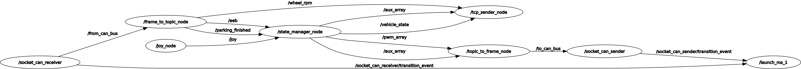

# ROS2 기반 RP4 상위 제어 시스템

## 개요
본 문서는 **ROS2 기반 RP4 상위 제어 시스템**의 노드 구조와 역할을 설명한다.  

---

## 노드 설명

### 1. `/socket_can_receiver`
- CAN frame을 ROS topic으로 변환

### 2. `/frame_to_topic_node`
- CAN frame 타입의 ROS topic을 ID에 맞는 타입으로 변환

### 3. `/joy_node`
- 컨트롤러 신호를 ROS topic으로 변환

### 4. `/state_manager_node`
- 차량의 상태(Remote, Parking, AEB)를 관리  
- 상태에 따른 PWM 계산 수행

### 5. `/tcp_sender_node`
- 차량의 상태, 속도, 방향지시등 정보를 앱에 전송

### 6. `/topic_to_frame_node`
- 타입에 따라 ROS topic을 CAN frame 타입의 ROS topic으로 변환

### 7. `/socket_can_sender`
- ROS topic을 CAN frame으로 변환

---
